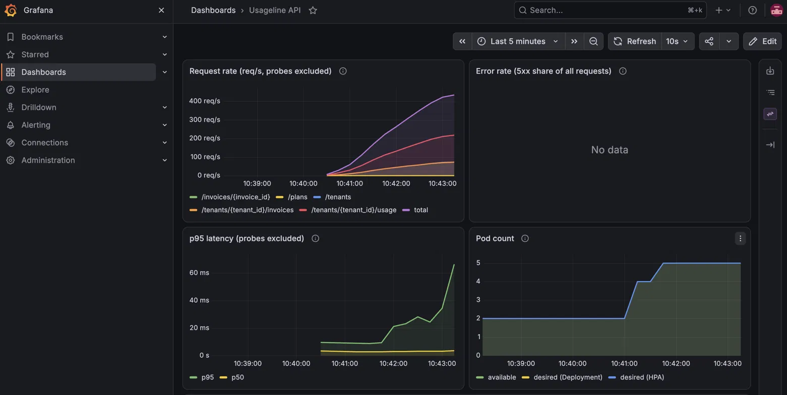
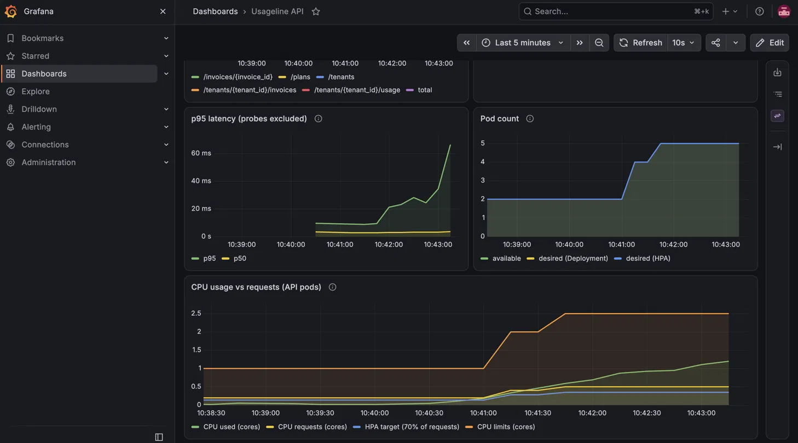

# Usageline

[](https://github.com/aadi1706/usageline/actions/workflows/ci.yml)

Usageline is a multi-tenant usage-based billing platform. Tenants subscribe to plans (a base fee, a number of included units and a per-unit overage price), report usage events, and an endpoint turns a billing period's usage into an invoice. The app is deliberately small (FastAPI + PostgreSQL); the focus of the project is the infrastructure around it: containers, Kubernetes with kind, Helm, Terraform, GitHub Actions and Prometheus/Grafana, all runnable locally for free.

## Run it

Requires Docker with Compose.

```bash
docker compose up --build -d
curl http://localhost:8001/health
```

- API: http://localhost:8001 (interactive docs at `/docs`)
- Postgres: `localhost:5433` (user/password/db: `usageline`)

Migrations run automatically when the API container starts. Stop with `docker compose down` (add `-v` to also delete the database volume).

### Example

```bash
curl -X POST localhost:8001/plans -H 'content-type: application/json' \
  -d '{"name":"starter","base_fee_cents":1000,"included_units":100,"unit_price_cents":5}'
curl -X POST localhost:8001/tenants -H 'content-type: application/json' \
  -d '{"name":"acme","plan_id":1}'
curl -X POST localhost:8001/tenants/1/usage -H 'content-type: application/json' \
  -d '{"metric":"api_calls","quantity":150}'
curl -X POST localhost:8001/tenants/1/invoices -H 'content-type: application/json' \
  -d '{"period_start":"2026-01-01T00:00:00Z","period_end":"2027-01-01T00:00:00Z"}'
```

## Run on Kubernetes (kind)

Requires `kind`, `kubectl` and `helm`.

```bash
./scripts/kind-up.sh      # create cluster, build + load image, install metrics-server and the chart
curl localhost:8081/health
curl localhost:8081/ready
./scripts/kind-down.sh    # delete the cluster
```

The cluster is called `usageline` and is exposed on host port 8081. The chart (`helm/usageline`) deploys 2 API replicas with an autoscaler (2 to 5), a dev-only Postgres StatefulSet, and runs database migrations as a Helm hook Job.

## Monitoring and load testing

```bash
./scripts/monitoring-up.sh   # kube-prometheus-stack in 'monitoring', then enables the API's ServiceMonitor, alerts and dashboard
kubectl --context kind-usageline -n monitoring port-forward svc/kps-grafana 3000:80   # http://localhost:3000 (admin/admin)
kubectl --context kind-usageline -n monitoring port-forward svc/kps-kube-prometheus-stack-prometheus 9090:9090
k6 run loadtest/k6.js        # ramping load against localhost:8081
```

The API exposes Prometheus metrics at `/metrics`. Alert meanings and what to do about them are in [docs/RUNBOOK.md](docs/RUNBOOK.md).

## Load test




*Load test on a local kind cluster: request rate climbs to ~440 req/s and the HPA scales the API from 2 to 5 pods. Single run, laptop-hosted, k6 on the same machine.*

Error panel shows no data because no 5xx responses occurred.

k6 results (`loadtest/k6.js`):

- 64,183 requests
- ~267 req/s average
- p95 96 ms
- 0.00% failed requests

## Infrastructure (Terraform, AWS)

`terraform/` defines a VPC, ECR, SQS (with a dead-letter queue), RDS PostgreSQL, EKS (with IRSA) and least-privilege IAM as modules, composed by `envs/dev` and `envs/prod`, with remote state in S3 (`terraform/bootstrap` creates the bucket). It is **validate-only**: it has been formatted, validated and statically analysed (`terraform fmt`, `validate`, `tflint`, `checkov` in CI, no AWS credentials), but never planned or applied. Estimated monthly cost is in [docs/COST_ESTIMATE.md](docs/COST_ESTIMATE.md).

```bash
cd terraform/envs/dev && terraform init -backend=false && terraform validate
```

## Run the tests

```bash
python3 -m venv .venv && .venv/bin/pip install -r requirements-dev.txt
.venv/bin/pytest
```

Tests use in-memory SQLite by default; set `TEST_DATABASE_URL` to run them against Postgres.

## API

| Method | Path | Purpose |
| --- | --- | --- |
| GET | `/health` | Liveness check (process is up) |
| GET | `/metrics` | Prometheus metrics |
| GET | `/ready` | Readiness check (database reachable, else 503) |
| POST/GET | `/plans` | Create / list plans |
| POST/GET | `/tenants`, GET `/tenants/{id}` | Create / list / fetch tenants |
| POST/GET | `/tenants/{id}/usage` | Record / list usage events |
| POST/GET | `/tenants/{id}/invoices` | Generate / list invoices |
| GET | `/invoices/{id}` | Fetch an invoice |

Invoice = plan base fee + max(0, units used in `[period_start, period_end)` - included units) x unit price. Amounts are integer cents.
